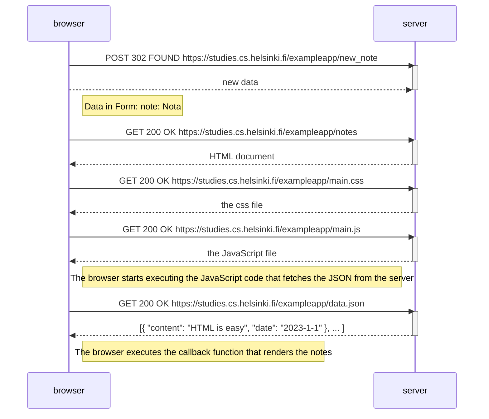
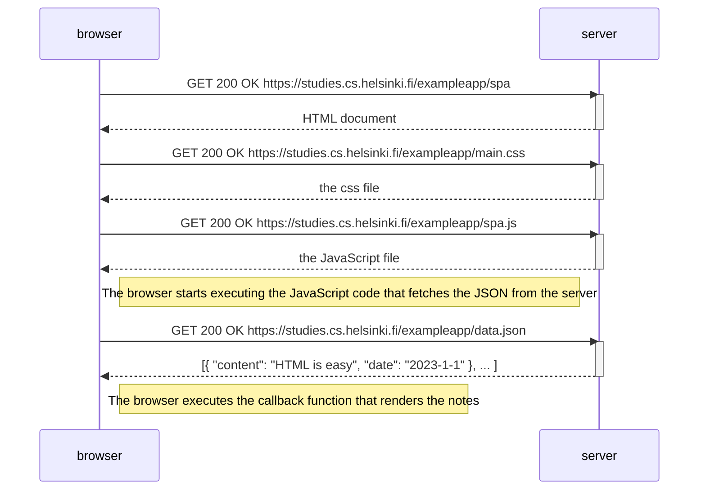
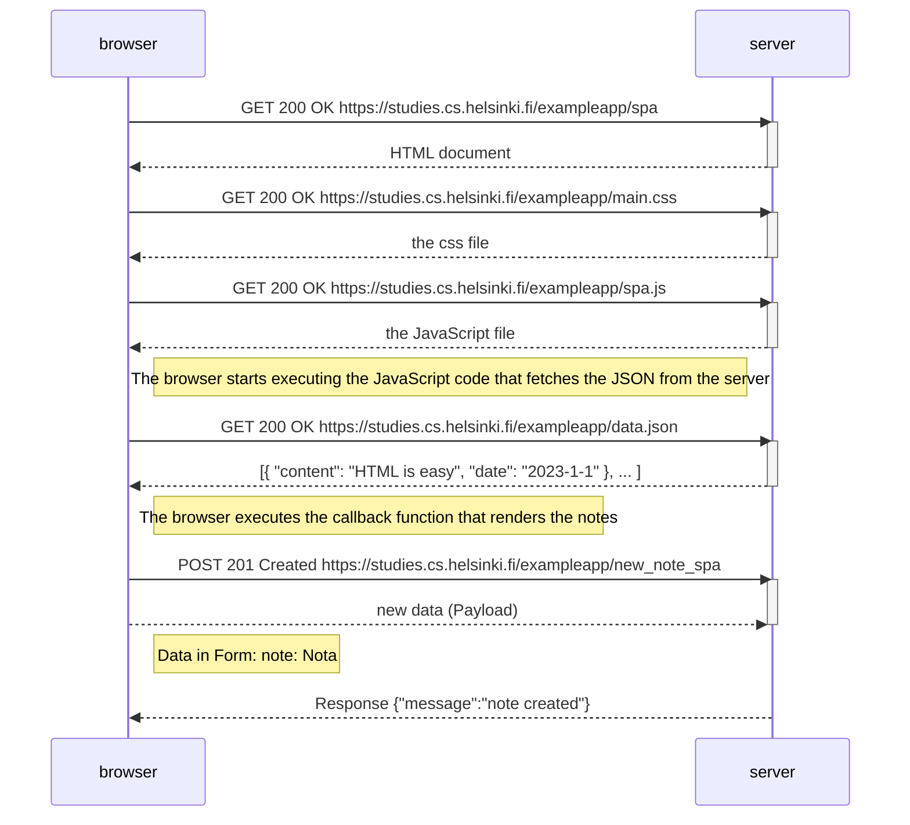

# part0
Fullstack Open Code

0.4: Nuevo diagrama de nota
Crea un diagrama que describa la situación en la que el usuario crea una nueva nota en la página https://studies.cs.helsinki.fi/exampleapp/notes escribiendo algo en el campo de texto y haciendo clic en el botón Save.

0.5: Diagrama de aplicación de una sola página
Crea un diagrama que describa la situación en la que el usuario accede a la versión de aplicación de una sola página de la aplicación de notas en https://studies.cs.helsinki.fi/exampleapp/spa.

0.6: Nueva nota en diagrama de aplicación de una sola pagina
Crea un diagrama que represente la situación en la que el usuario crea una nueva nota utilizando la versión de una sola página de la aplicación.

